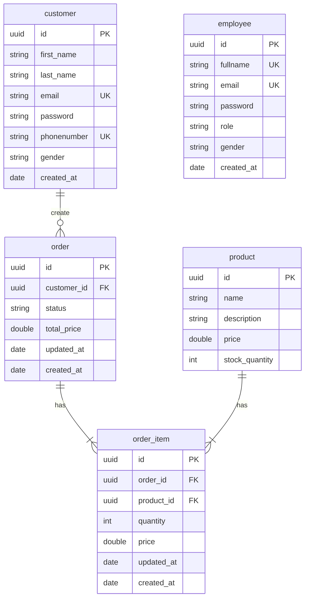

# كۆرسی سپرینگبووت به‌ زمانی كوردی 
ئه‌م كۆرسه‌ باس له‌ دروستكردنی پرۆجێكتێكی (باكئێند) ده‌كه‌ین به‌ فره‌یمۆركی سپرینگبووت، كه‌ تێیدا باسی كۆنسێپته‌كانی باكئێندم كردووه‌ به‌و فره‌یمۆركه‌.
- ده‌توانی له‌ یوتوب چه‌ناڵه‌كه‌م ته‌ماشای ڤیدیۆیه‌كه‌ بكه‌ی كه‌ به‌ش به‌ش باسمكردووه‌.
-  ئه‌م كۆرسه‌ سه‌ره‌تایه‌كه‌ بۆ ئه‌وانه‌ی ده‌یانه‌وێ بێنه‌ ناو دنیای سپرینگبووت له‌ باكئێند.
____
This course explains building a (backend) project using Spring-Boot framework, in which I explained backend concepts using this framework.
- You can watch the video on my YouTube channel in which I explained it part by part in Kurdish language.
- This course is the beginning for those who want to enter the world of Spring-Boot in the backend.

____
### Lab A3 - YouTube Channel
Video: https://www.youtube.com/watch?v=IUpcreuS8jY
____
### Clone the repo on master branch using `git`
Before running the project locally, you have to have these:
- IntelliJ IDE [install](https://www.jetbrains.com/idea/)
- Java 21 [install](https://www.oracle.com/java/technologies/downloads/#jdk21-windows). YouTube [tutorial](https://youtu.be/-hxCPXjYWJU?si=DZacUnOLoC2vbav2).
- Docker Desktop (For running postgres DB) [install](https://www.docker.com/products/docker-desktop/).
- And a laptop to run all of these things ;).

____
### Code Solution
- The `master` branch doesn't have the implementation rather than it is the start of the course.
- The `SpringStarter` branch has all the implementation. Each commit is a part where I explained it in the video.
   - Along with that I added `docs.md` in that branch, which are the notes for each part.
____
### Project Overview
The project that we are building is a store project, where we have two users (employee, customer). Employees manage products, and customers orders products from the store.
- We also implemented Spring Security for authenticating user and authorization on each endpoints based on the role.
- Explained testing briefly in general, however the method didn't work for Spring-Boot version 4 :(
- Explained pagination and sorting.
- Working with Database using Liquibase and Hibernate/JPA.

And more...

____
### Database Design

